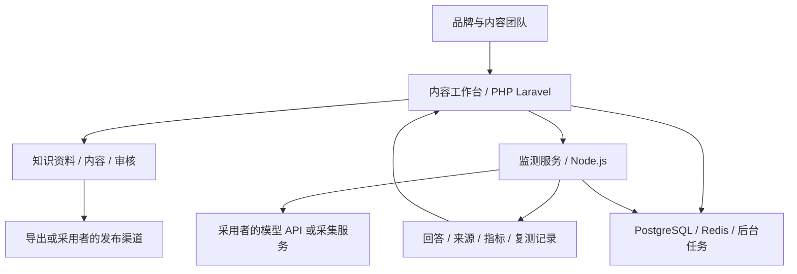

# CowTech GEO 白皮书

## 从 AI 可见度观察到内容执行与复核

文档版本：0.1 · 2026-10-04 · v0.1.0 发行文档。本文是产品与技术说明，不是已发表的独立效果实验，不含虚构客户案例。

## 1. 摘要

CowTech GEO 的目标是让品牌团队管理一条可追踪的工作链：以问题集建立观察基线，记录生成式回答中的品牌和来源，识别内容机会，结合知识资料制作和审核内容，发布到采用者选择的渠道，再观察后续变化。

产品价值在于连接数据与执行、保留来源和边界，而非宣称能控制生成式平台的推荐。采用者拥有自己的部署、账号和第三方服务配置；核心自托管流程不依赖 CowTech 付费订单。

## 2. 问题定义

现有工作常断在四个地方：观察只有截图而没有条件；分数没有对应行动；内容与事实资料分离；发布完成后没有一致的复核方式。单独解决其中一步，仍需要团队手工拼接其余流程。

CowTech 将这些环节连接起来，同时保留人工决策：选择问题、判断来源、确认事实、批准发布、解释变化。自动化承担重复操作，不代替真实性判断。

## 3. 方法与范围

GEO 研究讨论生成式引擎响应中的内容可见度及其优化方法；本产品借鉴这种问题定义，不将研究实验的提升幅度当作 CowTech 的效果。[研究背景](https://arxiv.org/abs/2311.09735)

我们的工作单元不是“全网排名”，而是一次具有明确条件的观察：品牌、问题集、语言、地区、供应商、模型或 surface、观测方式、时间和结果状态。浏览器回答、模型 API 与 API 回退必须分别标识。

首版范围以内容工作台和监测服务为主。商业支付履约、独立站点工具、历史技能包不因“全套方案”这一表述而自动成为已验证发行组件。

## 4. 六阶段工作流程

1. **建档**：整理品牌名称、网站、业务、竞争对象和目标问题。名称别名需人工确认，避免误匹配。
2. **观察**：使用采用者配置的服务执行问题集，保存回答及状态。失败与不可用也是结果状态，不能用合成回答补齐。
3. **分析**：提取品牌提及与来源，计算限定样本内的自定义指标，定位信息缺口。
4. **制作**：将机会变成 brief 和文章任务，引用知识库资料，检查事实和引用。
5. **交付**：人工审核后导出或通过已配置渠道发布，记录目标链接和交付状态。
6. **复核**：在可比条件下再次采样，记录变化与混杂因素。发布成功不等于被 AI 引用。

## 5. 参考架构

工作台承担账号、资料、文章、分发与业务界面；监测服务承担观察编排、解析、评分及监测记录。两者通过采用者配置的内部地址与认证连接。数据库可共用基础设施，但应使用分别管理的数据库和凭据。

该图描述逻辑关系，不表示浏览器或每个供应商已经通过新发行环境验证。

## 6. 数据可信度设计

- 默认供应商状态为未配置；生产环境不允许 mock/fixture 生成观测。
- 调用受权限、额度、预算和外部传输开关约束。受限任务不自动降级成模拟任务。
- 知识库未配置 embedding 时使用文本检索；语义检索只比较真实且模型、维度兼容的向量。
- 内容生成、事实检查、人工批准和发布确认是不同状态，不互相替代。
- 保存观察来源类型；模型 API 成功不能升级成网页观测成功。

部分路径仍需发行适配。例如仅具备模拟实现的文章扩展在生产被拒绝，本稿不将其描述为已可用的真实扩写服务。

## 7. 指标与解释

CowTech 的可见度、来源质量与竞争压力分数是代码定义的启发式指标。品牌提及率使用已成功解析回答作为分母，不代表总体消费者触达。任何报告都应同时记录尝试次数、成功解析数及失败情况。

具体公式与等级见[指标说明](METRICS.zh-CN.md)。低样本量、问题选择、时间差、平台变化和采集失败都会影响解释。若改变问题集、来源类型或模型，应建立新基线，而非直接宣称提升。

## 8. 自托管与服务责任

采用者自行配置数据库、Redis、邮件、AI/embedding 模型、采集和发布账号。源代码不附带第三方订阅，也不消除第三方使用费用。模型调用可能把问题、品牌资料或文章发送给配置的供应商；采用者决定哪些资料可以出站。

本地账号权限与外部服务授权分离。自托管能力档位不代表支付权益，也不自动打开所有付费调用。密钥留空是发行要求，真实接入逻辑应保留；不能用空函数或演示输出替代。

## 9. 当前验证证据

三项发行边界修复后，PHP 回归 358 项通过、6050 个断言通过；Node 默认套件 879 项通过、41 项跳过。被跳过的一项另以生产运行模式，在隔离 PostgreSQL、Redis 和本地 HTTP 供应商测试服务下执行并通过，剩余 40 项未运行。

隔离验证覆盖：未配置和模拟请求明确拒绝、拒绝时不创建运行记录、预算门禁不制造模拟任务，以及真实适配器向本地 HTTP 测试服务发送请求。这不是对真实第三方付费账号的端到端验收，也不是效果基准。

## 10. 发行前待完成事项

需要完成干净源码组装、全仓凭证与客户数据排除、代码来源及许可证核对、无测试数据的新安装初始化、服务互通、至少一个真实采样和一个真实交付渠道验收。最终公开仓库不携带旧提交历史，但按实际情况保留必要版权与许可声明。

当前不承诺统一安装器、一键全平台接入、保证推荐、保证引用或商业增长。后续改进应优先降低采用成本并增加可复核证据，而不是扩大未经验证的宣传范围。

## 11. 结论

CowTech GEO 要解决的是：让团队知道观察到了什么、为什么采取内容行动、发布了什么、之后又观察到了什么。它提供一套自托管、可接入、可追踪的工作基础；最终内容质量和效果解释仍需要真实数据与人的判断。
